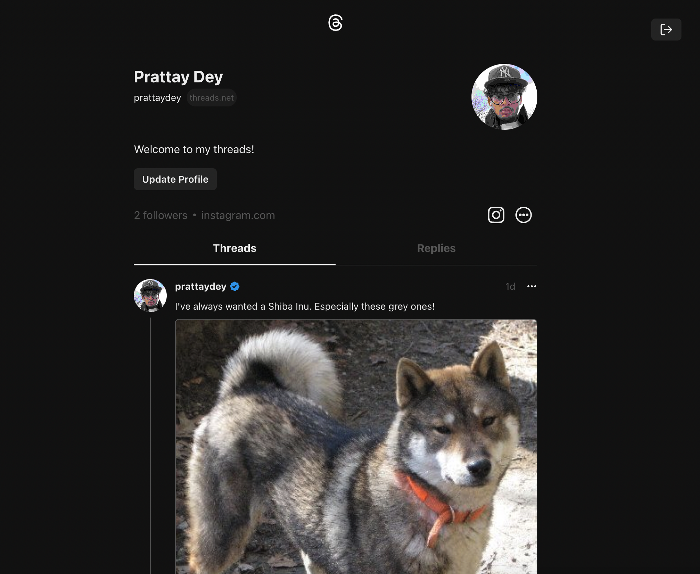
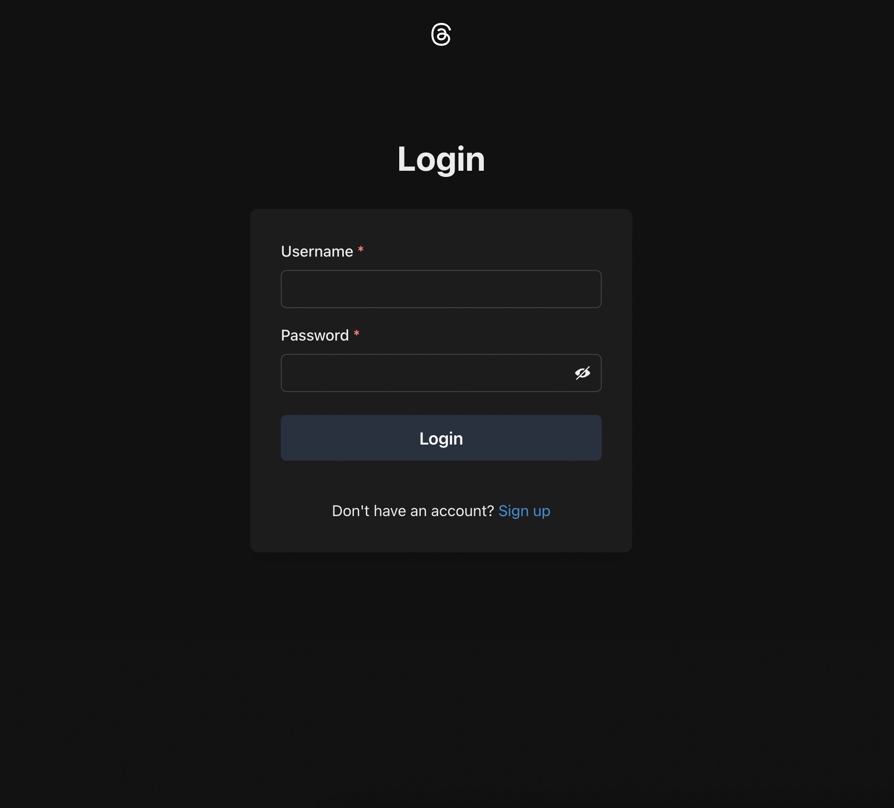
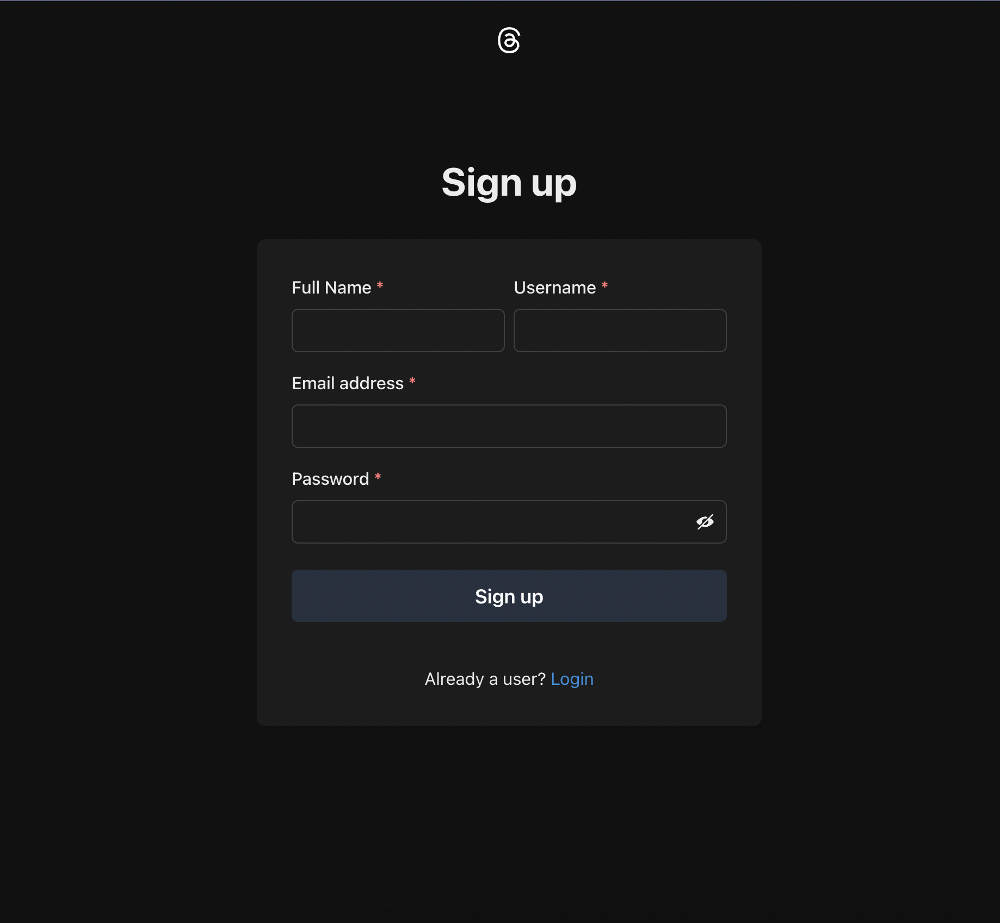
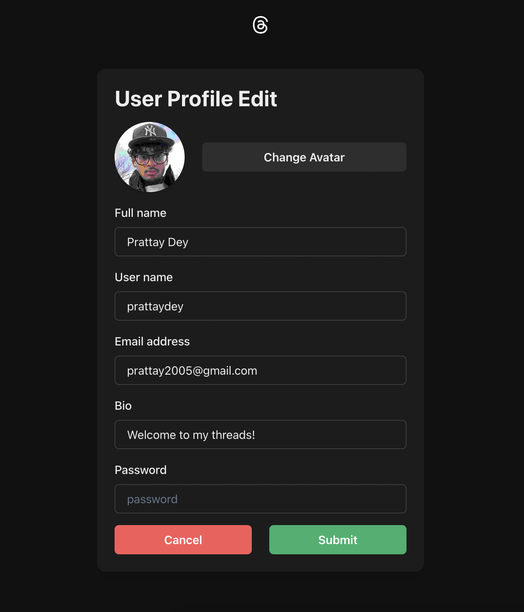

# Instagram Threads Clone using MERN Full-Stack
***README Still Work-In-Progress***
## Description

This project is a web-based social media application built on the MERN (MongoDB, Express.js, React.js, Node.js) stack. It allows for users to register their own accounts and sign in, update their profile, create their own posts or view others, as well as follow/unfollow others. A live chat feature is currently in development to allow closer connections between users.

## Key Features

1. **User Authentication**: Supports user sign-in and sign-up with proper authentication.
2. **Session Management**: Utilizes session handling for security and enhanced user experience.
3. **Profile Updates**: Allows users to update their profile (name, profile picture, bio, etc.) at any time.
4. **Threads Generation**: Allows users to create their own posts with images, as well as view and reply to others.
5. In Progress...
6.

## Technical Stack

- **MongoDB**: 
- **Express.js**: 
- **React.js & Chakra UI**: 
- **Node.js**: 

# Images:

